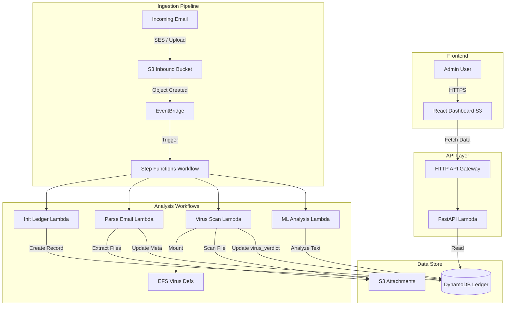

# Cloud Email Analyzer

A serverless, event-driven email security platform built on AWS. This application automatically analyzes incoming emails for viruses and metadata anomalies, providing a real-time dashboard for security administrators.

## 🚀 Features

* **Automated Pipeline:** Ingests emails via SES/S3 and triggers analysis workflows automatically.
* **Virus Scanning:** Serverless ClamAV scanning for email attachments using AWS Lambda & EFS.
* **Metadata Analysis:** Extracts headers, sender info, and subjects for security verdicts.
* **Real-time Dashboard:** React-based admin UI to view traffic stats, verdicts, and search email history.
* **Infrastructure as Code:** Fully reproducible architecture using Terraform and AWS SAM.

## 🏗 Architecture

The system uses a hybrid serverless architecture:

1.  **Ingestion:** Emails are stored in an S3 Inbound Bucket (triggered via SES or direct upload).
2.  **Orchestration:** EventBridge triggers an AWS Step Function pipeline.
3.  **Processing:**
    * `init_ledger`: Creates a transaction record in DynamoDB.
    * `parse_email`: Extracts attachments and metadata to S3.
    * `virus-scan`: Checks attachments using a ClamAV Lambda with EFS-mounted virus definitions.
    * `ml-analysis`: Assigns phishing verdicts (Safe/Suspicious/Unsafe) and spam verdicts.
4.  **API:** FastAPI (Python) running on Lambda behind HTTP API Gateway.
5.  **Frontend:** Single Page Application (React + Tailwind) hosted on S3.



## 🛠 Tech Stack

* **Cloud Provider:** AWS
* **IaC:** Terraform (Core Infra), AWS SAM/CloudFormation (ClamAV & EFS)
* **Backend:** Python 3.11+, FastAPI, AWS Lambda, DynamoDB, Step Functions
* **Frontend:** React, TypeScript, Tailwind CSS
* **Containerization:** Docker (for Lambda functions)

## 📋 Prerequisites

* [AWS CLI](https://aws.amazon.com/cli/) (configured with `eu-central-1` or your preferred region)
* [Terraform](https://www.terraform.io/) (v1.6+)
* [Docker Desktop](https://www.docker.com/) (running)
* [Node.js](https://nodejs.org/) (v18+)

## 📦 Deployment Guide

### 1. Backend Infrastructure (Terraform)

Deploy the core infrastructure (Networking, DynamoDB, API Gateway, S3, Core Lambdas).

```bash
cd infra/terraform
terraform init
terraform apply -var-file="../env/dev/terraform.tfvars"
```

### 2. Virus Scanner (SAM/CloudFormation)

The ClamAV function requires EFS and special networking, managed by a separate CloudFormation stack.

```bash
# From the root directory
sam deploy --template-file clam-av.yaml --stack-name clam-av-stack --capabilities CAPABILITY_NAMED_IAM
```

Here is the rest of the README.md, starting from step 2 of the deployment guide.
Markdown

### 2. Virus Scanner (SAM/CloudFormation)

The ClamAV function requires EFS and special networking, managed by a separate CloudFormation stack.

```bash
# From the root directory
sam deploy --template-file clam-av.yaml --stack-name clam-av-stack --capabilities CAPABILITY_NAMED_IAM
```

### 3. Frontend Dashboard

Build the React application and sync it to the static hosting S3 bucket.
Bash

```bash
cd frontend
npm install
npm run build

# Get your bucket name from terraform outputs
BUCKET_NAME=$(terraform output -raw frontend_bucket_name)

# Sync files
aws s3 sync ./dist s3://$BUCKET_NAME --delete
```

Here is the rest of the README.md, starting from step 2 of the deployment guide.
Markdown

### 2. Virus Scanner (SAM/CloudFormation)

The ClamAV function requires EFS and special networking, managed by a separate CloudFormation stack.

```bash
# From the root directory
sam deploy --template-file clam-av.yaml --stack-name clam-av-stack --capabilities CAPABILITY_NAMED_IAM
```

### 3. Frontend Dashboard

Build the React application and sync it to the static hosting S3 bucket.

```bash
cd frontend
npm install
npm run build

# Get your bucket name from terraform outputs
BUCKET_NAME=$(terraform output -raw frontend_bucket_name)

# Sync files
aws s3 sync ./dist s3://$BUCKET_NAME --delete
```

💻 Usage
Accessing the Dashboard

Get your frontend URL from Terraform:

```bash
terraform output frontend_url
```

Open the link in your browser to view the Administrator Dashboard.
Testing the Pipeline

You can test the flow by uploading a raw .eml file to the Inbound S3 bucket:

```bash
aws s3 cp test_email.eml s3://cloud-email-analyzer-dev-inbound/emails/
```

Check the dashboard after a few seconds to see the analysis result.
API Documentation

The backend provides auto-generated documentation. Access it via the dashboard "API Docs" link or directly at: https://<your-api-id>.execute-api.eu-central-1.amazonaws.com/dev/docs