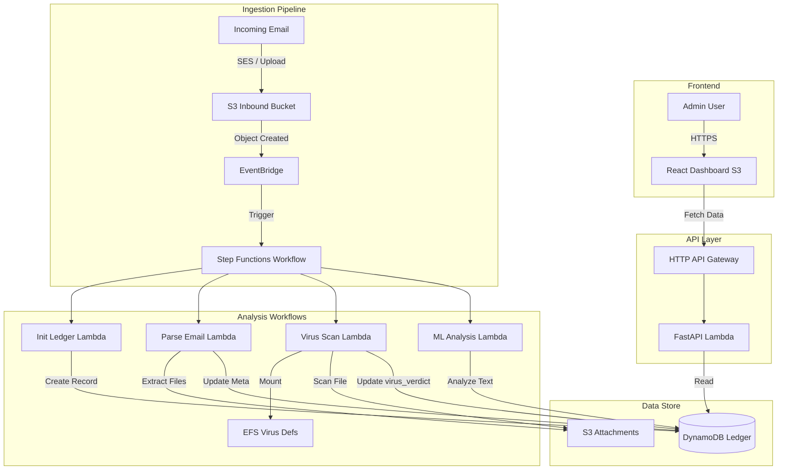

# Cloud Email Analyzer

A serverless, event-driven email security platform built on AWS. This application automatically analyzes incoming emails for viruses and metadata anomalies, providing a real-time dashboard for security administrators.

## Features

* **Automated Pipeline:** Ingests emails via SES/S3 and triggers analysis workflows automatically.
* **Virus Scanning:** Serverless ClamAV scanning for email attachments using AWS Lambda & EFS.
* **Metadata Analysis:** Extracts headers, sender info, and subjects for security verdicts.
* **Real-time Dashboard:** React-based admin UI to view traffic stats, verdicts, and search email history.
* **Infrastructure as Code:** Fully reproducible architecture using Terraform and AWS SAM.

## Architecture

The system uses a hybrid serverless architecture:

1.  **Ingestion:** Emails are stored in an S3 Inbound Bucket (triggered via SES or direct upload).
2.  **Orchestration:** EventBridge triggers an AWS Step Function pipeline.
3.  **Processing:**
    * `init_ledger`: Creates a transaction record in DynamoDB.
    * `parse_email`: Extracts attachments and metadata to S3.
    * `virus-scan`: Checks attachments using a ClamAV Lambda with EFS-mounted virus definitions.
    * `ml-analysis`: Assigns phishing verdicts (Safe/Suspicious/Unsafe) and spam verdicts.
4.  **API:** FastAPI (Python) running on Lambda behind HTTP API Gateway.
5.  **Frontend:** Single Page Application (React + Tailwind) hosted on S3.


```mermaid
graph TD
    subgraph Frontend
        UI[React Dashboard S3]
        User[Admin User]
        User -->|HTTPS| UI
    end

    subgraph "API Layer"
        APIGW[HTTP API Gateway]
        FastAPI[FastAPI Lambda]
        UI -->|Fetch Data| APIGW
        APIGW --> FastAPI
    end

    subgraph "Data Store"
        DDB[(DynamoDB Ledger)]
        S3_Attach[S3 Attachments]
        FastAPI -->|Read| DDB
    end

    subgraph "Ingestion Pipeline"
        Email[Incoming Email]
        S3_In[S3 Inbound Bucket]
        EB[EventBridge]
        StepFn[Step Functions Workflow]
        
        Email -->|SES / Upload| S3_In
        S3_In -->|Object Created| EB
        EB -->|Trigger| StepFn
    end

    subgraph "Analysis Workflows"
        Init[Init Ledger Lambda]
        Parse[Parse Email Lambda]
        ClamAV[Virus Scan Lambda]
        EFS[EFS Virus Defs]
        ML[ML Analysis Lambda]

        StepFn --> Init
        Init -->|Create Record| DDB
        
        StepFn --> Parse
        Parse -->|Extract Files| S3_Attach
        Parse -->|Update Meta| DDB

        StepFn --> ClamAV
        ClamAV -->|Mount| EFS
        ClamAV -->|Scan File| S3_Attach
        ClamAV -->|Update virus_verdict| DDB

        StepFn --> ML
        ML -->|Analyze Text| DDB
    end
```

## Tech Stack

* **Cloud Provider:** AWS
* **IaC:** Terraform (Core Infra), AWS SAM/CloudFormation (ClamAV & EFS)
* **Backend:** Python 3.11+, FastAPI, AWS Lambda, DynamoDB, Step Functions
* **Frontend:** React, TypeScript, Tailwind CSS
* **Containerization:** Docker (for Lambda functions)

## Prerequisites

* [AWS CLI](https://aws.amazon.com/cli/) 
* [Terraform](https://www.terraform.io/)
* [Docker Desktop](https://www.docker.com/)
* [Node.js](https://nodejs.org/)

## Deployment Guide

## LocalStack Demo

The local demo does not require AWS SES or Route53. It simulates SES inbound
mail by uploading a raw `.eml` file to LocalStack S3 and emitting the shared
`MailReceived` EventBridge event used by the analysis pipeline.

```bash
make local-up
make local-build
make local-deploy
make local-create-users
make local-seed-phishing
make local-ui
```

Open `http://localhost:5173` and sign in with one of the demo accounts:

* `admin@demo.local` / `admin123!demo`
* `alice@demo.local` / `alice123!demo`
* `bob@demo.local` / `bob123!demo`

Useful seed commands:

```bash
make local-seed-benign
make local-seed-phishing
make local-seed-eicar
```

`make local-ui` builds the React dashboard and starts both the FastAPI API and
static dashboard containers. `make local-api` is still available when you want
to run only the API in the foreground.

For Codex/demo runs, use the wrapper targets:

```bash
make codex-start
make codex-status
make codex-stop
```

`codex-start` starts LocalStack, deploys the local pipeline, creates demo users,
seeds demo messages only when the message table is empty, and starts the API and
dashboard. `codex-stop` stops LocalStack, API, and dashboard containers without
deleting the LocalStack volume.

Local mode keeps the AWS-compatible serverless shape: S3, EventBridge, Step
Functions, Lambda packages, DynamoDB, FastAPI, and React. AWS-only resources
such as SES, Route53, CloudFront, EFS, and ClamAV signature updater are disabled
for `local-dev`.

### 1. Backend Infrastructure (Terraform)

Deploy the core infrastructure (Networking, DynamoDB, API Gateway, S3, Core Lambdas).

```bash
cd infra/terraform
terraform init
terraform apply -var-file="../env/dev/terraform.tfvars"
```

### 2. Virus Scanner (SAM/CloudFormation)

The ClamAV function requires EFS and special networking, managed by a separate CloudFormation stack.

```bash
sam deploy --template-file clam-av.yaml --stack-name clam-av-stack --capabilities CAPABILITY_NAMED_IAM
```

### 3. Frontend Dashboard

Build the React application and sync it to the static hosting S3 bucket.

```bash
cd frontend
npm install
npm run build

BUCKET_NAME=$(terraform output -raw frontend_bucket_name)

aws s3 sync ./dist s3://$BUCKET_NAME --delete
```

Usage
Accessing the Dashboard

Get your frontend URL from Terraform:

```bash
terraform output frontend_url
```

Open the link in your browser to view the Administrator Dashboard.
Testing the Pipeline

You can test the flow by uploading a raw .eml file to the Inbound S3 bucket:

```bash
aws s3 cp test_email.eml s3://cloud-email-analyzer-dev-inbound/emails/
```

Check the dashboard after a few seconds to see the analysis result.
API Documentation

The backend provides auto-generated documentation. Access it via the dashboard "API Docs" link
